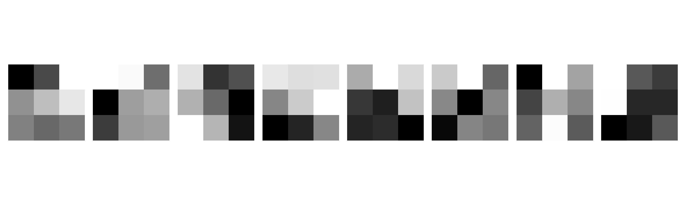
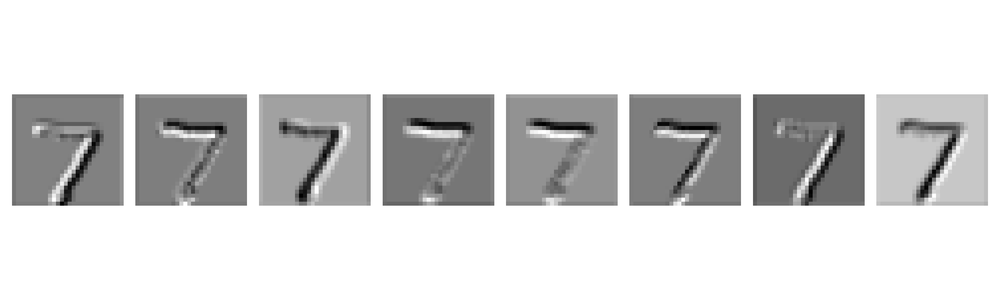
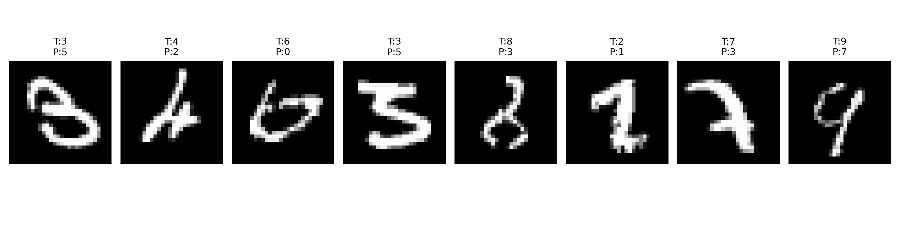
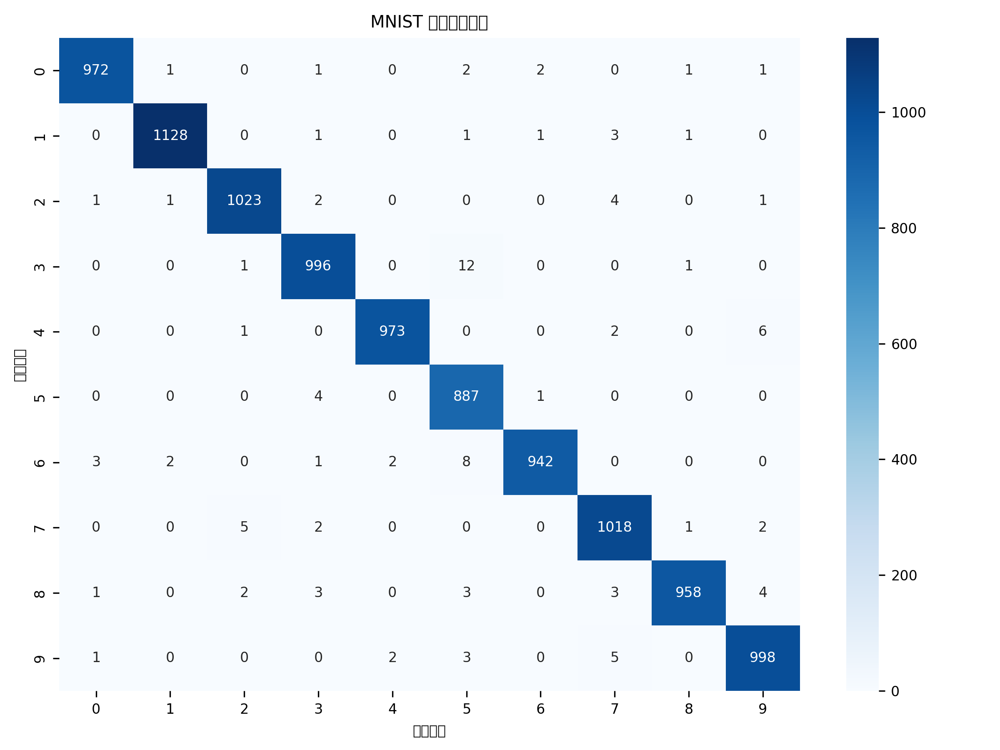

# 2023102949-automation-lizhen-work10
# 第10次实验：CNN训练过程、优化器、学习率及特征可视化分析
## 一、实验目的
本实验在已有MNIST手写数字CNN分类模型基础上，进一步探究深度学习模型训练规律，具体目标如下：
1. 理解优化器、学习率对CNN模型收敛速度与分类精度的影响；
2. 对比SGD、SGD+Momentum、Adam三种优化器的训练效果；
3. 固定Adam优化器，对比`0.1、0.01、0.001`三种学习率的收敛差异；
4. 实现CNN第一层卷积核与Feature Map特征图可视化，理解网络底层特征提取原理；
5. 可视化模型错误分类样本，分析错分原因并给出改进思路；
6. 绘制测试集混淆矩阵，量化分析各类别间混淆程度。

## 二、实验环境
- 编程语言：Python
- 深度学习框架：PyTorch、torchvision
- 依赖库：numpy、matplotlib、seaborn、scikit-learn
- 运行设备：CPU/GPU自适应

## 三、实验数据集与模型结构
### 1. 数据集
采用MNIST手写数字数据集，包含0~9共10类灰度手写数字，图像尺寸为`1×28×28`；
划分方式：训练集80%、验证集20%，独立测试集用于最终模型评估。

### 2. 复用CNN基础模型结构
```
Conv1(1→16, 3×3, padding=1) → ReLU → MaxPool(2×2)
Conv2(16→32, 3×3, padding=1) → ReLU → MaxPool(2×2)
Flatten
FC1(32×7×7 → 128) → ReLU
FC2(128 → 10)
```
包含卷积层、激活函数、池化层、全连接层，满足图像分类基础网络要求。

## 四、任务1：基础模型训练（Adam + lr=0.001）
### 训练参数
- 迭代轮数：10 epoch
- BatchSize：64
- 损失函数：CrossEntropyLoss
- 优化器：Adam，学习率`lr=0.001`

### 训练过程数据
|Epoch|Train Loss|Train Acc|Val Loss|Val Acc|
|---|---|---|---|---|
|1|0.1787|94.54%|0.0651|98.06%|
|2|0.0541|98.33%|0.0542|98.30%|
|3|0.0374|98.79%|0.0516|98.34%|
|4|0.0271|99.13%|0.0561|98.33%|
|5|0.0214|99.33%|0.0410|98.89%|
|6|0.0163|99.47%|0.0514|98.61%|
|7|0.0145|99.51%|0.0487|98.82%|
|8|0.0101|99.66%|0.0480|98.82%|
|9|0.0085|99.70%|0.0515|98.82%|
|10|0.0095|99.66%|0.0546|98.64%|

### 测试结果
- Test Loss: 0.0440
- Test Accuracy: 98.95%

## 五、任务2：不同优化器对比实验
固定网络结构、迭代轮数与数据集，设置三组对比：SGD、SGD+Momentum、Adam。

### 1. SGD（lr=0.01）训练结果
|Epoch|Train Loss|Train Acc|Val Loss|Val Acc|
|---|---|---|---|---|
|1|0.7117|80.44%|0.2714|91.47%|
|2|0.2121|93.60%|0.1692|94.72%|
|3|0.1406|95.75%|0.1193|96.42%|
|4|0.1075|96.71%|0.0989|97.08%|
|5|0.0885|97.41%|0.1118|96.43%|
|6|0.0766|97.65%|0.0790|97.51%|
|7|0.0665|97.90%|0.0766|97.55%|
|8|0.0587|98.22%|0.0823|97.50%|
|9|0.0539|98.32%|0.0685|97.95%|
|10|0.0491|98.49%|0.0784|97.66%|
- Test Loss: 0.0653
- Test Accuracy: 97.78%

### 2. SGD+Momentum（lr=0.01，momentum=0.9）训练结果
|Epoch|Train Loss|Train Acc|Val Loss|Val Acc|
|---|---|---|---|---|
|1|0.2725|91.61%|0.0961|97.04%|
|2|0.0667|97.95%|0.0662|98.01%|
|3|0.0458|98.55%|0.0447|98.71%|
|4|0.0355|98.87%|0.0524|98.34%|
|5|0.0275|99.12%|0.0499|98.56%|
|6|0.0224|99.29%|0.0434|98.58%|
|7|0.0170|99.46%|0.0334|99.04%|
|8|0.0135|99.55%|0.0393|98.92%|
|9|0.0104|99.69%|0.0395|98.95%|
|10|0.0095|99.70%|0.0364|99.03%|
- Test Accuracy: 99.06%

### 3. 优化器综合对比表
|优化器|学习率|最终训练Loss|最终训练Acc|最终验证Loss|最终验证Acc|测试Acc|
|---|---|---|---|---|---|---|
|SGD|0.01|0.0491|98.49%|0.0784|97.66%|97.78%|
|SGD+Momentum|0.01|0.0095|99.70%|0.0364|99.03%|99.06%|
|Adam|0.001|0.0095|99.66%|0.0546|98.64%|98.95%|

### 4. 结果分析
1. 纯SGD收敛速度最慢，前期损失高、准确率低，最终测试精度最低；
2. 引入Momentum动量后，收敛速度明显加快，参数更新震荡减小，泛化能力与测试精度显著提升；
3. Adam具备自适应学习率特性，收敛平稳、精度优异，综合性能接近带动量的SGD；
4. 整体效果：`SGD < Adam < SGD+Momentum`。

## 六、任务3：学习率对比实验
固定优化器为Adam，分别设置学习率`0.1、0.01、0.001`，对比收敛效果。

### 1. lr=0.1 结果
模型完全不收敛，损失维持在2.3左右，准确率稳定在10%随机猜测水平。
- Test Accuracy: 9.58%

### 2. lr=0.01 结果
模型可以收敛，但后期损失震荡，精度提升受限。
- Test Accuracy: 97.65%

### 3. lr=0.001 结果
收敛平稳、迭代后期损失持续下降，验证集与测试集精度最高。
- Test Accuracy: 98.95%

### 4. 学习率对比汇总
|学习率|测试准确率|收敛情况|结论|
|---|---|---|---|
|0.1|9.58%|完全不收敛|学习率过大，参数震荡无法收敛|
|0.01|97.65%|收敛一般|可收敛但精度偏低，后期震荡|
|0.001|98.95%|收敛最佳|步长适中，收敛平稳泛化能力强|

### 5. 分析总结
1. 学习率过大会导致参数更新跨过最优解，模型无法拟合数据；
2. 学习率中等可收敛，但收敛速度慢、易陷入局部最优；
3. 学习率适中时，模型收敛稳定，能有效拟合数据且泛化能力最优。

## 七、任务4：卷积核可视化


1. 可视化展示了网络第一层8个卷积核，训练后卷积核呈现**水平边缘、竖直边缘、斜向纹理、明暗轮廓**等底层视觉特征；
2. 卷积核初始为随机参数，通过前向传播计算损失、反向传播迭代更新，不断自适应学习适合手写数字识别的底层特征；
3. 第一层卷积核主要负责提取图像基础边缘与轮廓信息，为后续高层特征分类提供支撑。

## 八、任务5：Feature Map特征图可视化


1. 任选一张测试手写数字图像，输入训练好的CNN，可视化第一层卷积输出的8张特征图；
2. 不同特征图对数字**边缘、笔画、明暗区域**响应强度不同，各自关注图像局部不同纹理特征；
3. 每个卷积核对应一种特征提取模式，多个特征图组合融合底层信息，使网络能够区分不同手写数字形态。

## 九、任务6：错误分类样本分析


1. 可视化测试集中8张错误分类样本，标注真实类别与预测类别；
2. 易混淆类别多为形态相近数字：**4与9、3与8、0与6**；
3. 错分原因：部分手写数字笔画变形、轮廓模糊、同类形态差异大，导致特征相似度极高；
4. 改进方案：采用数据增强、加深网络结构、增加Dropout抑制过拟合、精细调优学习率与优化器。

## 十、任务7：混淆矩阵分析


1. 混淆矩阵**对角线元素**：真实类别与预测类别一致，代表分类正确的样本数量；
2. **非对角线元素**：真实与预测类别不一致，代表被错误分类的样本；
3. 矩阵中混淆最严重的为外形相似数字：4↔9、3↔8、0↔6，与错误样本观察结果一致。

## 十一、实验总结
本次实验完整完成7项任务，复用基础CNN模型，完成了**三种优化器对比、三种学习率对比、卷积核可视化、特征图可视化、错误样本分析、混淆矩阵评估**。
实验验证了：优化器动量机制可加快收敛、Adam自适应学习率表现优异；学习率过大易不收敛，适中学习率模型效果最优；CNN第一层可自动学习边缘纹理等底层特征，相似手写数字易发生混淆。通过可视化与量化表格，深入理解了CNN训练机制与特征提取原理。

---

