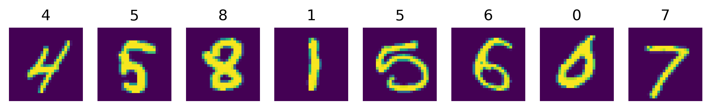
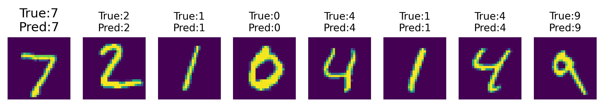
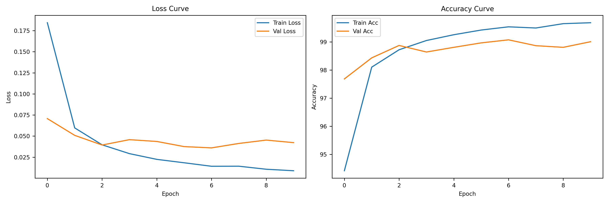

# 2023102949-automation-lizhen-work9
# 实验 8：PyTorch 入门与图像分类
## 一、实验目的
本实验基于 PyTorch 实现图像分类任务，完整复现深度学习标准流程：
数据加载 → 模型定义 → 训练 → 验证 → 测试 → 结果分析。

## 二、实验环境
- Python 3.x
- PyTorch + torchvision
- NumPy、Matplotlib

## 三、数据集说明（MNIST）
- 数据集：MNIST 手写数字
- 图像尺寸：1×28×28（灰度图）
- 类别：0~9 共 10 类
- 划分：训练集48000、验证集12000、测试集10000

## 四、CNN 模型结构（基础版）
```
Conv1(1→16, 3×3, padding=1) → ReLU → MaxPool(2×2)
Conv2(16→32, 3×3, padding=1) → ReLU → MaxPool(2×2)
Flatten
FC1(32×7×7 → 128) → ReLU
FC2(128 → 10)
```

## 五、训练参数
- Epochs：10
- Batch size：64
- 损失函数：CrossEntropyLoss
- 优化器：Adam
- 学习率：0.001

---

# 六、实验结果展示

## 1. 训练样本可视化


## 2. 测试集预测结果（真实标签 + 预测标签）


## 3. 训练曲线（Loss & Accuracy）


---

# 七、基础任务训练结果
| Epoch | Train Loss | Train Acc | Val Loss | Val Acc |
|-------|------------|-----------|----------|---------|
| 1     | 0.2060     | 93.90%    | 0.0773   | 97.54%  |
| 2     | 0.0558     | 98.28%    | 0.0444   | 98.61%  |
| 3     | 0.0377     | 98.83%    | 0.0416   | 98.70%  |
| 4     | 0.0295     | 99.10%    | 0.0431   | 98.71%  |
| 5     | 0.0222     | 99.33%    | 0.0412   | 98.77%  |
| 6     | 0.0172     | 99.50%    | 0.0392   | 98.78%  |
| 7     | 0.0140     | 99.56%    | 0.0436   | 98.73%  |
| 8     | 0.0126     | 99.58%    | 0.0561   | 98.43%  |
| 9     | 0.0103     | 99.65%    | 0.0416   | 98.94%  |
| 10    | 0.0087     | 99.73%    | 0.0490   | 98.75%  |

## 测试集结果
- Test Loss：0.0451
- Test Accuracy：**98.68%**

---

# 八、进阶任务 1：改进网络结构
改进内容：
- 增加卷积层
- 增加卷积核数量
- 加入 Dropout(0.5)
- 增大全连接层

测试结果：
- Test Loss：0.0264
- Test Acc：**99.24%**

---

# 九、进阶任务 2：优化器对比
| Optimizer | Learning Rate | Test Accuracy |
|-----------|---------------|---------------|
| SGD       | 0.01          | 98.89%        |
| Adam      | 0.001         | 98.90%        |

---

# 十、进阶任务 3：MNIST vs CIFAR-10
| 数据集 | 图像类型 | 类别数 | 测试准确率 | 难度 |
|--------|----------|--------|------------|------|
| MNIST  | 灰度手写数字 | 10 | 98.68% | 低 |
| CIFAR-10 | 彩色自然图 | 10 | 71.36% | 高 |

CIFAR-10 测试准确率：**71.36%**

---

# 十一、结果分析
1. 训练 loss 随 epoch 增加**持续下降**，收敛正常。
2. 验证 accuracy **逐步上升**，模型有效。
3. 训练与验证 accuracy 差距**较小**，无严重过拟合。
4. 易混淆类别：4/9、3/8、0/6。
5. CIFAR-10 更难，因特征复杂、彩色、背景干扰大。

---

# 十二、实验总结
完成全部基础任务 + 进阶任务：
- 环境配置 ✅
- 数据加载与划分 ✅
- CNN 模型搭建、训练、测试 ✅
- 图片可视化 ✅
- 进阶对比实验 ✅

最终精度：
- 基础模型：98.68%
- 改进模型：99.24%
- CIFAR-10：71.36%
```
