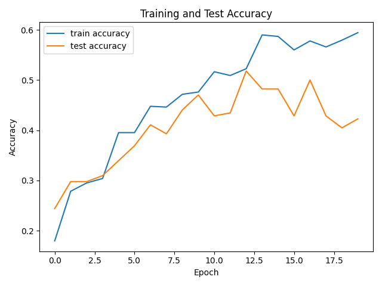
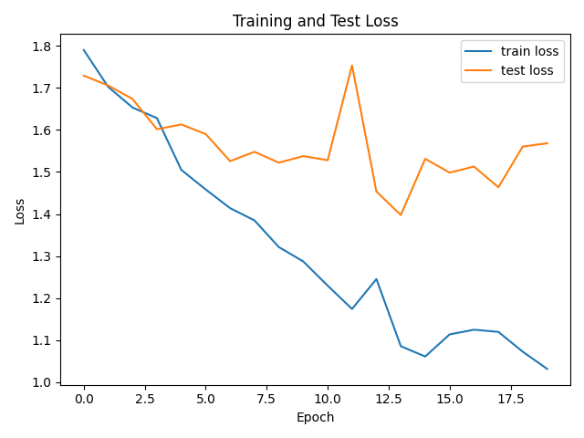
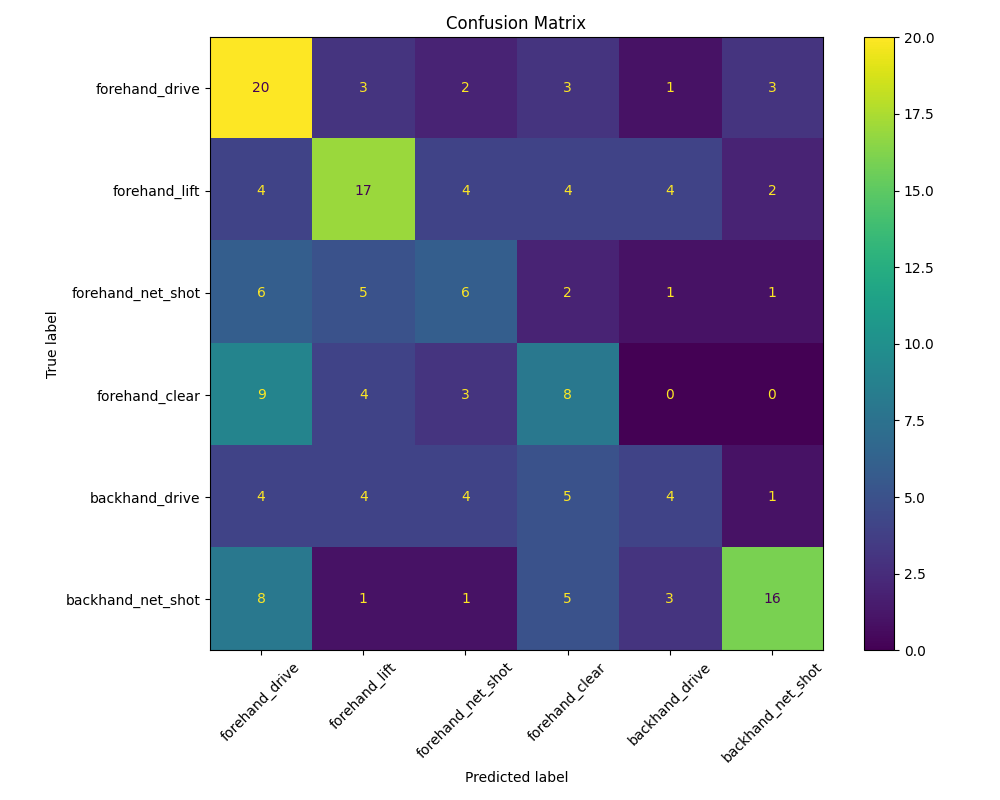

# Skeleton Transformer for Badminton Action Recognition

## 1. Project Overview

This project implements a badminton stroke action recognition system based on **MediaPipe Pose** and a lightweight **Skeleton Transformer**. Instead of directly feeding raw video frames into a large video model, this experiment first extracts human pose landmarks from each video frame and converts each video into a skeleton time sequence. A Transformer Encoder is then used to classify the badminton stroke action.

The main idea is:

```text
Badminton video
    ↓
MediaPipe Pose landmark extraction
    ↓
Skeleton sequence: [30, 132]
    ↓
Skeleton Transformer
    ↓
6-class badminton action prediction
```

In this project, each frame contains 33 human pose landmarks. Each landmark has four values: `x`, `y`, `z`, and `visibility`, so the feature dimension of one frame is:

```text
33 × 4 = 132
```

Each video is resampled to 30 frames, so each sample has the shape:

```text
[30, 132]
```

---

## 2. Repository Structure

The files in this repository are uploaded in the same folder. Therefore, the result images in this README use relative paths such as `./accuracy_curve.png` instead of `runs/accuracy_curve.png`.

```text
work13/
├── README.md
├── preprocess.py
├── model.py
├── train.py
├── inference.py
├── utils.py
├── accuracy_curve.png
├── loss_curve.png
└── confusion_matrix.png
```

During local running, the full project directory was organized as follows:

```text
Badminton_Transformer/
├── data/
│   ├── raw_videos/
│   │   ├── backhand_drive/
│   │   ├── backhand_net_shot/
│   │   ├── forehand_clear/
│   │   ├── forehand_drive/
│   │   ├── forehand_lift/
│   │   └── forehand_net_shot/
│   └── processed/
├── runs/
│   ├── best_model.pth
│   ├── accuracy_curve.png
│   ├── loss_curve.png
│   ├── confusion_matrix.png
│   └── history.json
├── preprocess.py
├── model.py
├── train.py
├── inference.py
└── utils.py
```

The `data/` folder and `best_model.pth` were generated or used locally during the experiment. The uploaded repository mainly contains the source code, report, and result figures.

---

## 3. Dataset

The dataset used in this experiment is the Kaggle badminton stroke video dataset: `badminton_storke_video`.

It contains 6 classes of badminton stroke actions:

| Label | Class Name | Description |
|---:|---|---|
| 0 | `forehand_drive` | Forehand drive |
| 1 | `forehand_lift` | Forehand lift |
| 2 | `forehand_net_shot` | Forehand net shot |
| 3 | `forehand_clear` | Forehand clear |
| 4 | `backhand_drive` | Backhand drive |
| 5 | `backhand_net_shot` | Backhand net shot |

---

## 4. Environment

The experiment was completed in VS Code with WSL Ubuntu.

Main libraries:

```text
Python 3.12
PyTorch
MediaPipe
OpenCV
NumPy
scikit-learn
matplotlib
tqdm
```

Install dependencies:

```bash
pip install numpy opencv-python mediapipe scikit-learn tqdm matplotlib torch
```

---

## 5. Data Preprocessing

The preprocessing process is implemented in `preprocess.py`.

Main steps:

1. Read videos from six class folders under `data/raw_videos/`.
2. Use OpenCV to read video frames.
3. Use MediaPipe Pose to extract 33 pose landmarks from each frame.
4. Convert each frame to a 132-dimensional feature vector.
5. Resample videos with different lengths to 30 frames.
6. Normalize the skeleton using the hip center as the origin and shoulder width as the scale.
7. Split the dataset into training and testing sets with `test_size = 0.2`.
8. Save the processed data as `.npy` files.

Preprocessing command:

```bash
python preprocess.py --data_dir data/raw_videos --out_dir data/processed --target_frames 30 --test_size 0.2
```

The processed data shapes are:

```text
X_train: (668, 30, 132)
y_train: (668,)
X_test:  (168, 30, 132)
y_test:  (168,)
```

This means that the training set contains 668 video samples and the test set contains 168 video samples. Each sample is represented as a skeleton sequence with shape `[30, 132]`.

---

## 6. Model Architecture

The model is defined in `model.py`. The main model is `SkeletonTransformer`.

Model structure:

```text
Input: [B, 30, 132]
    ↓
Linear Embedding: 132 → 128
    ↓
Position Embedding
    ↓
Transformer Encoder × 2
    ↓
Mean Pooling
    ↓
MLP Classifier
    ↓
Output logits: [B, 6]
```

Model parameters:

| Parameter | Value | Description |
|---|---:|---|
| `input_dim` | 132 | Feature dimension of each frame |
| `target_frames` | 30 | Number of frames for each video |
| `d_model` | 128 | Transformer hidden dimension |
| `nhead` | 4 | Number of attention heads |
| `num_layers` | 2 | Number of Transformer Encoder layers |
| `dim_feedforward` | 256 | Feed-forward hidden dimension |
| `num_classes` | 6 | Number of action classes |
| `dropout` | 0.1 | Dropout rate |

`model.py` does not need to be run directly. It is imported by `train.py` and `inference.py`:

```python
from model import SkeletonTransformer
```

---

## 7. Training and Evaluation

The training process is implemented in `train.py`.

Training settings:

| Item | Setting |
|---|---|
| Loss function | `CrossEntropyLoss` |
| Optimizer | `Adam` |
| Learning rate | `1e-3` |
| Batch size | `16` |
| Epochs | `20` |
| Evaluation metrics | Accuracy, confusion matrix, classification report |

Training command:

```bash
python train.py --epochs 20 --batch_size 16
```

After training, the following files were generated locally:

```text
runs/best_model.pth
runs/accuracy_curve.png
runs/loss_curve.png
runs/confusion_matrix.png
runs/history.json
```

For submission, the three result figures were uploaded to the same folder as `README.md`, so the image links below use direct relative paths.

---

## 8. Experimental Results

### 8.1 Accuracy Curve



The training accuracy increases steadily during training and reaches about 0.60 by the end. The test accuracy increases in the early stage and reaches the best value of **0.5179**, but it later fluctuates and finally decreases to **0.4226**.

This indicates that the model learns useful skeleton motion features, but the generalization ability is still limited.

---

### 8.2 Loss Curve



The training loss decreases continuously from about 1.79 to about 1.03, which shows that the model is fitting the training data. However, the test loss does not decrease steadily and has clear fluctuations after several epochs.

This suggests that the model has some overfitting. The model performs better and better on the training set, but the performance on the test set does not improve consistently.

---

### 8.3 Confusion Matrix



The confusion matrix is:

```text
[[20  3  2  3  1  3]
 [ 4 17  4  4  4  2]
 [ 6  5  6  2  1  1]
 [ 9  4  3  8  0  0]
 [ 4  4  4  5  4  1]
 [ 8  1  1  5  3 16]]
```

From the confusion matrix:

- `forehand_drive` performs relatively well: 20 out of 32 samples are correctly classified.
- `forehand_lift` also has relatively stable performance: 17 out of 35 samples are correctly classified.
- `backhand_net_shot` has 16 correct predictions out of 34 samples.
- `forehand_clear` is often misclassified as `forehand_drive`, which means that different forehand actions have similar skeleton motion patterns.
- `backhand_drive` has the weakest performance, with only 4 correct predictions out of 22 samples.
- Some backhand actions are misclassified as forehand actions, showing that body skeleton information alone may not be enough to distinguish racket direction and hitting position.

---

### 8.4 Classification Report

```text
                    precision    recall  f1-score   support

forehand_drive          0.39      0.62      0.48        32
forehand_lift           0.50      0.49      0.49        35
forehand_net_shot       0.30      0.29      0.29        21
forehand_clear          0.30      0.33      0.31        24
backhand_drive          0.31      0.18      0.23        22
backhand_net_shot       0.70      0.47      0.56        34

accuracy                                      0.42       168
macro avg              0.42      0.40      0.40       168
weighted avg           0.44      0.42      0.42       168
```

Final test accuracy:

```text
0.4226
```

Best test accuracy:

```text
0.5179
```

Overall, the model completes the basic badminton action recognition task, but the classification performance still has room for improvement.

---

## 9. Single Video Inference

After training, `inference.py` was used to test a single video sample.

Inference command:

```bash
python inference.py --video "data/raw_videos/forehand_clear/009.mp4"
```

Inference result:

```text
========== 推理结果 ==========
Predicted class: forehand_drive
Confidence: 0.4848

所有类别概率:
forehand_drive: 0.4848
forehand_lift: 0.2349
forehand_net_shot: 0.1011
forehand_clear: 0.0664
backhand_drive: 0.0483
backhand_net_shot: 0.0645
```

The selected video comes from the `forehand_clear` folder, but the model predicts it as `forehand_drive`. This is an incorrect prediction. This result is consistent with the confusion matrix, where `forehand_clear` is often confused with `forehand_drive`.

---

## 10. Discussion

The final test accuracy is **0.4226**, and the best test accuracy is **0.5179**. Although the accuracy is not very high, the complete workflow has been successfully implemented, including video reading, skeleton extraction, sequence preprocessing, Transformer training, testing, confusion matrix visualization, and single-video inference.

Main observations:

1. **Overfitting appears during training**  
   The training loss keeps decreasing, while the test loss fluctuates. The training accuracy also continues to increase, but the test accuracy does not improve consistently.

2. **Forehand actions are easy to confuse**  
   `forehand_clear` is often predicted as `forehand_drive`. These actions are both forehand strokes and may have similar body movement patterns.

3. **Backhand drive is difficult to recognize**  
   The recall of `backhand_drive` is low. This means the model often fails to correctly identify this class.

4. **Skeleton-only features have limitations**  
   Badminton strokes are related not only to body pose, but also to racket position, shuttlecock trajectory, hitting point, and motion speed. MediaPipe Pose only provides body landmarks, so some fine-grained stroke differences are difficult to classify.

5. **Pose extraction quality affects recognition**  
   Fast motion, occlusion, low image quality, or incomplete body regions can reduce the quality of pose landmarks and affect the final classification result.

---

## 11. Possible Improvements

Future improvements may include:

1. **Add velocity and acceleration features**  
   Instead of using only keypoint coordinates, the model can also use frame-to-frame motion differences.

2. **Use early stopping**  
   Since the best test accuracy is higher than the final test accuracy, early stopping can reduce overfitting.

3. **Improve regularization**  
   A larger dropout rate, weight decay, or a smaller model may improve generalization.

4. **Apply data augmentation**  
   Skeleton noise, temporal cropping, temporal scaling, and horizontal flipping can increase data diversity.

5. **Use racket or shuttlecock information**  
   Adding racket position or shuttlecock trajectory may help distinguish similar actions such as drive, clear, lift, and net shot.

6. **Compare with other sequence models**  
   BiLSTM, Temporal Convolutional Network, or a deeper Transformer can be tested for comparison.

---

## 12. Conclusion

This experiment successfully implemented a badminton stroke recognition system based on MediaPipe Pose and Skeleton Transformer. The raw videos were converted into human skeleton time sequences, and a Transformer Encoder was used to classify six badminton stroke classes.

The results show that this method is computationally efficient and interpretable, because it uses human pose landmarks rather than raw video pixels. However, the accuracy is limited because some badminton strokes have very similar body movements and the model does not use racket or shuttlecock information.

In conclusion, the experiment completed the required workflow of preprocessing, model training, testing, result visualization, and single-sample inference, and verified the feasibility of using skeleton sequence Transformer for badminton action recognition.
