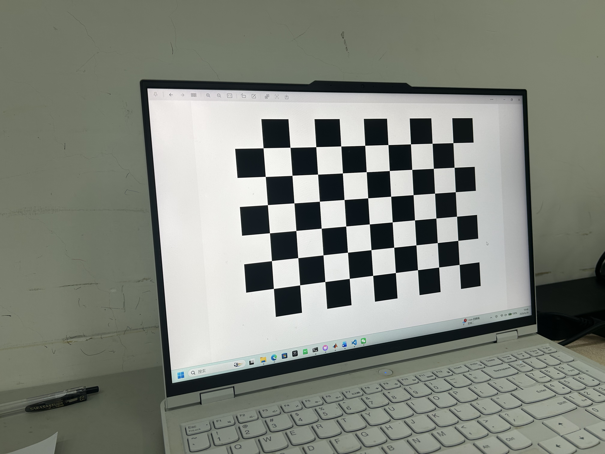
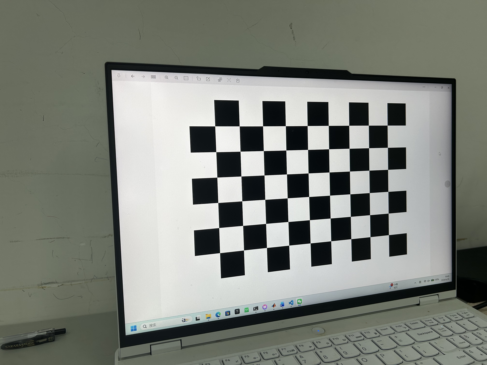
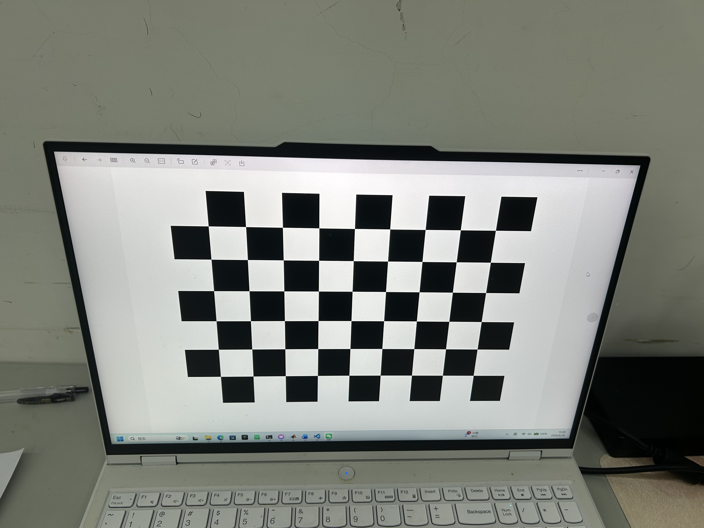
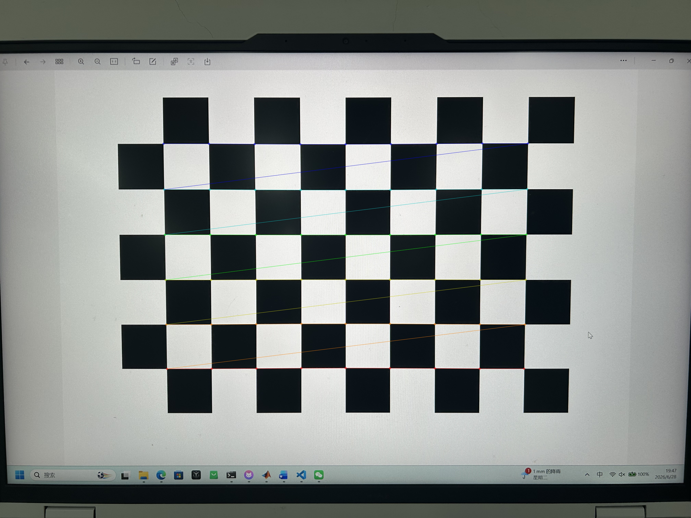
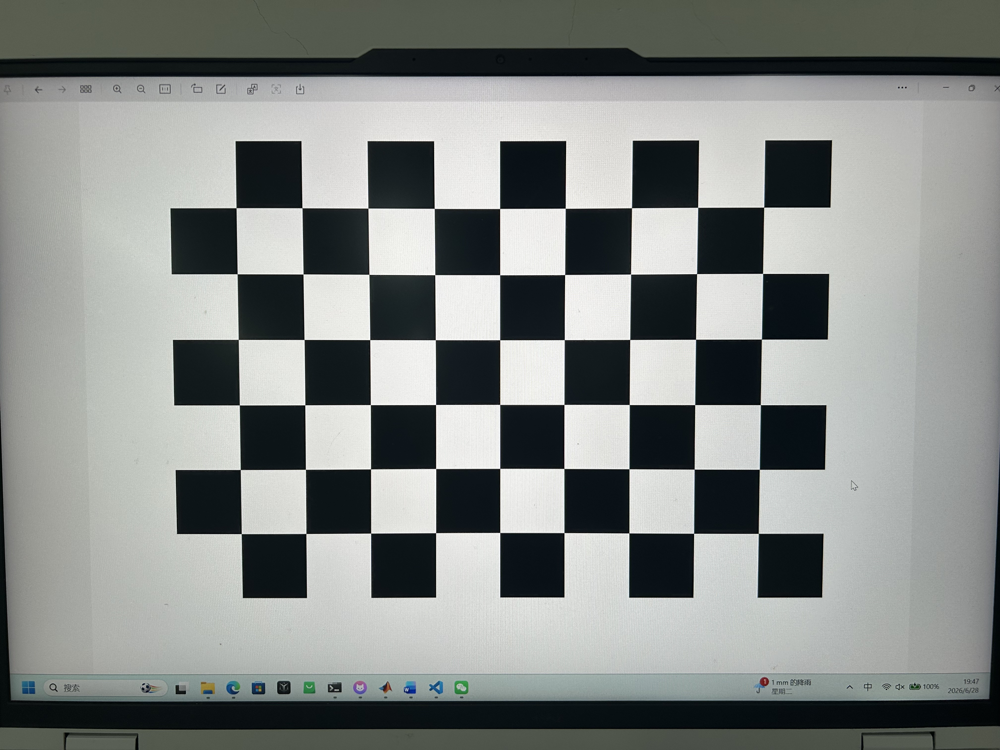
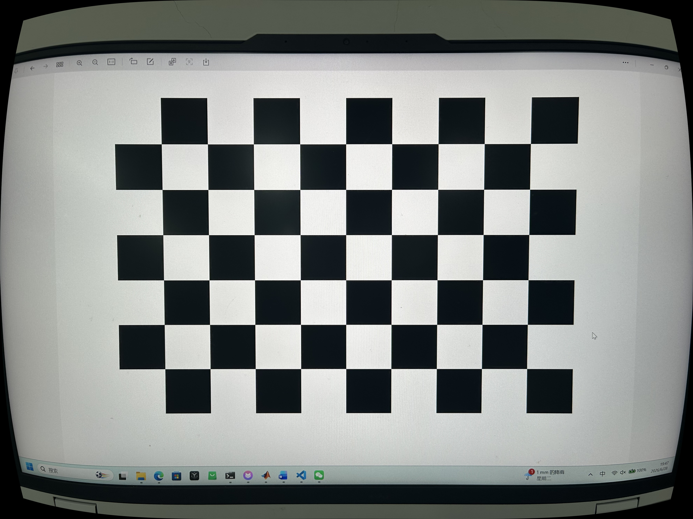
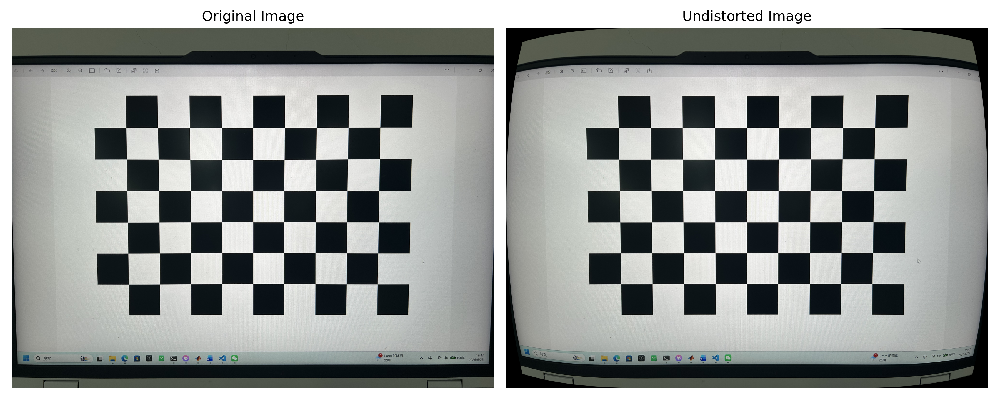

# 使用棋盘格进行相机标定实验报告

## 一、实验名称

使用棋盘格进行相机标定  
Camera Calibration Using a Checkerboard Pattern

---

## 二、实验目的

本实验使用棋盘格图案对相机进行标定。通过采集不同姿态下的棋盘格图像，建立棋盘格三维角点与图像二维角点之间的对应关系，利用 OpenCV 完成相机内参矩阵、畸变参数以及每张标定图片外参的估计。实验过程包括棋盘格角点检测、亚像素角点优化、相机标定、重投影误差计算以及图像去畸变处理。

相机成像模型为：

$$
s\mathbf{p}=K[R|t]\mathbf{P}
$$

其中，$K$ 为相机内参矩阵，$R$ 和 $t$ 分别表示相机外参中的旋转矩阵和平移向量，$\mathbf{P}$ 为三维空间点，$\mathbf{p}$ 为二维图像点，$s$ 为比例因子。

---

## 三、实验环境

| 项目 | 内容 |
|---|---|
| 操作系统 | Ubuntu / WSL 环境 |
| 开发工具 | Visual Studio Code |
| 编程语言 | Python |
| OpenCV 版本 | 4.13.0 |
| 主要库 | opencv-python、numpy、matplotlib |
| 源代码文件 | `calibrate.py` |
| 标定图片文件夹 | `images/` |
| 输出结果文件夹 | `output/` |

---

## 四、棋盘格信息

| 项目 | 内容 |
|---|---|
| 棋盘格来源 | 电脑屏幕显示版棋盘格 |
| 内角点数量 | 9 × 6 |
| 方格边长 | 22.0 mm |
| 有效标定图片数量 | 15 张 |

说明：本实验中使用的是棋盘格的**内角点数量**，即横向 9 个内角点、纵向 6 个内角点，而不是黑白方格的数量。由于棋盘格通过电脑屏幕显示，因此实验前测量了屏幕中实际显示的单个方格边长，并在程序中设置为 `SQUARE_SIZE = 22.0`，单位为 mm。

---

## 五、相机信息

| 项目 | 内容 |
|---|---|
| 相机类型 | 手机相机 |
| 拍摄对象 | 电脑屏幕显示的棋盘格 |
| 图像分辨率 | 4032 × 3024 |
| 镜头类型 | 普通手机镜头 / 默认镜头 |
| 拍摄要求 | 同一相机、同一镜头、同一分辨率 |

---

## 六、标定图片采集情况

本实验共采集 15 张棋盘格图像。拍摄时使棋盘格在图像中呈现不同位置和姿态，包括正对、偏左、偏右、不同距离以及一定倾斜角度，从而提高相机标定结果的可靠性。程序运行结果显示，15 张图片均成功检测到棋盘格角点。

### 6.1 标定图片样例

以下为部分不同姿态下的棋盘格标定图片样例：








---

## 七、程序实现过程

程序文件为：

```text
calibrate.py
```

程序主要步骤如下：

1. 定义棋盘格内角点数量：`CHECKERBOARD = (9, 6)`；
2. 定义棋盘格真实方格边长：`SQUARE_SIZE = 22.0`；
3. 根据棋盘格内角点数量生成标定板坐标系下的三维点坐标；
4. 读取 `images/` 文件夹中的全部标定图片；
5. 使用 `cv2.findChessboardCorners()` 检测棋盘格角点；
6. 使用 `cv2.cornerSubPix()` 对角点进行亚像素精度优化；
7. 使用 `cv2.calibrateCamera()` 估计相机内参矩阵、畸变参数和外参；
8. 使用重投影误差评价标定精度；
9. 使用 `cv2.undistort()` 对图像进行去畸变处理；
10. 保存角点检测图、去畸变图、对比图以及标定结果文本。

---

## 八、角点检测结果

程序共读取 15 张图片，15 张图片均成功检测到棋盘格角点，检测结果如下：

```text
共读取到 15 张图片。
有效标定图片数量：15
```

角点检测成功的图片包括：

```text
images/images1.jpg
images/images10.jpg
images/images11.jpg
images/images12.jpg
images/images13.jpg
images/images14.jpg
images/images15.jpg
images/images2.jpg
images/images3.jpg
images/images4.jpg
images/images5.jpg
images/images6.jpg
images/images7.jpg
images/images8.jpg
images/images9.jpg
```

### 8.1 角点检测结果图

以下为程序绘制出的棋盘格角点检测结果：




说明：图中彩色线条和角点标记表示 OpenCV 成功识别出的棋盘格内角点。角点分布完整，说明图像可以用于后续相机标定。

---

## 九、相机标定结果

### 9.1 相机内参矩阵 K

本次实验标定得到的相机内参矩阵为：

```text
K =
[[3.08998263e+03 0.00000000e+00 2.03167516e+03]
 [0.00000000e+00 3.08943332e+03 1.51080206e+03]
 [0.00000000e+00 0.00000000e+00 1.00000000e+00]]
```

即：

```text
fx = 3089.98263
fy = 3089.43332
cx = 2031.67516
cy = 1510.80206
```

相机内参矩阵可写为：

$$
K=\begin{bmatrix}
3089.98263 & 0 & 2031.67516 \\
0 & 3089.43332 & 1510.80206 \\
0 & 0 & 1
\end{bmatrix}
$$

---

### 9.2 畸变参数 D

本次实验得到的畸变参数为：

```text
D = [k1, k2, p1, p2, k3]
  = [ 2.53300861e-01, -1.40194995e+00, -2.83398256e-04,
      3.37700389e-05,  2.26928323e+00 ]
```

即：

| 参数 | 数值 |
|---|---:|
| k1 | 0.253300861 |
| k2 | -1.40194995 |
| p1 | -0.000283398256 |
| p2 | 0.0000337700389 |
| k3 | 2.26928323 |

其中，$k_1$、$k_2$、$k_3$ 为径向畸变参数，$p_1$、$p_2$ 为切向畸变参数。

---

### 9.3 平均重投影误差

本次实验得到的平均重投影误差为：

```text
Mean reprojection error: 0.0873 pixels
```

该误差明显低于 1 pixel，说明本次相机标定结果具有较高精度，角点检测和参数估计结果较为可靠。

---

## 十、去畸变结果

程序对一张原始图像进行了去畸变处理，并保存了原图、去畸变图以及对比图。

| 文件 | 说明 |
|---|---|
| `output/original.jpg` | 原始图像 |
| `output/undistorted.jpg` | 去畸变后的图像 |
| `output/comparison.jpg` | 原图与去畸变图拼接对比 |
| `output/undistortion_comparison.png` | 带标题的去畸变对比图 |

### 10.1 原图



### 10.2 去畸变图像



### 10.3 原图与去畸变图像对比



从图像对比可以看出，去畸变后图像边缘区域发生了明显几何校正，画面周围出现黑色区域，这是畸变校正后图像重新映射造成的正常现象。由于拍摄对象为屏幕上的棋盘格，原图中棋盘格本身较规则，因此中心区域变化不大；而在图像边缘位置，去畸变效果更加明显。

---

## 十一、实验结果分析

### 11.1 fx 和 fy 是否接近？

标定结果中：

```text
fx = 3089.98263
fy = 3089.43332
```

二者差值为：

```text
|fx - fy| = 0.54931
```

相对于焦距数值约 3089 来说，该差值非常小，说明相机在水平方向和竖直方向上的焦距尺度基本一致，标定结果合理。

---

### 11.2 cx 和 cy 是否接近图像中心？

本实验图像分辨率为：

```text
4032 × 3024
```

因此图像中心坐标约为：

```text
(4032 / 2, 3024 / 2) = (2016, 1512)
```

标定结果中主点坐标为：

```text
cx = 2031.67516
cy = 1510.80206
```

其中，$c_x$ 与图像中心横坐标相差约 15.68 像素，$c_y$ 与图像中心纵坐标相差约 1.20 像素。相对于 4032 × 3024 的图像分辨率来说，该偏差较小，因此主点位置接近图像中心，结果合理。

---

### 11.3 重投影误差是否合理？

本次实验平均重投影误差为：

```text
0.0873 pixels
```

该误差小于 1 pixel，说明检测到的二维角点与通过标定参数重新投影得到的角点位置非常接近，标定精度较高。因此，本次相机标定结果可以认为是合理的。

---

### 11.4 是否有角点检测失败？

本实验共读取 15 张标定图片，15 张图片全部成功检测到棋盘格角点，因此没有角点检测失败的图片。

```text
有效标定图片数量：15
角点检测失败数量：0
```

这说明棋盘格图案清晰、内角点数量设置正确，且大部分图像满足角点检测要求。

---

### 11.5 如何改进实验？

虽然本次实验的重投影误差较低，但仍可以从以下方面进一步改进：

1. 使用打印棋盘格并固定在硬纸板上，减少电脑屏幕显示带来的反光和像素纹理影响；
2. 增加更多拍摄角度，特别是让棋盘格覆盖图像边缘和四角区域；
3. 避免棋盘格过度靠近图像边界，保证所有内角点完整可见；
4. 保持棋盘格平整，避免屏幕或纸张弯曲造成额外误差；
5. 使用原始图片，不使用社交软件压缩后的图片；
6. 增加标定图片数量，例如采集 20 张以上图片，提高参数估计稳定性。

---

## 十二、实验结论

本实验使用 9 × 6 内角点棋盘格完成了相机标定。程序成功读取 15 张标定图片，并全部检测到棋盘格角点。通过 OpenCV 标定函数得到了相机内参矩阵、畸变参数以及平均重投影误差。实验结果显示，$f_x$ 与 $f_y$ 非常接近，主点坐标 $c_x$、$c_y$ 接近图像中心，平均重投影误差为 0.0873 pixels，低于 1 pixel，说明标定结果较为准确。

去畸变结果表明，图像边缘区域的几何畸变得到了一定校正，达到了相机标定和图像去畸变的实验目的。


